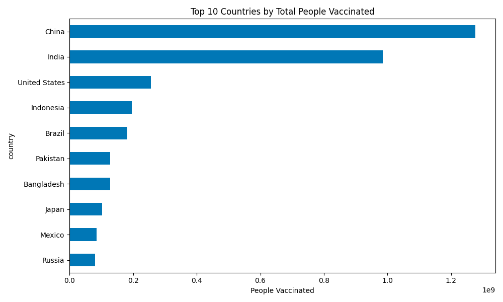
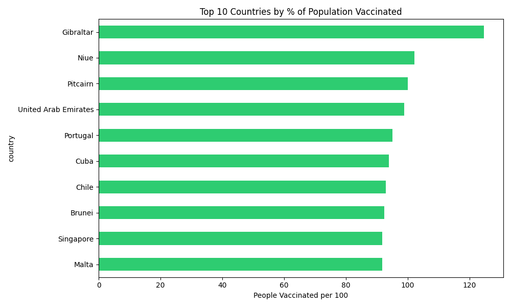
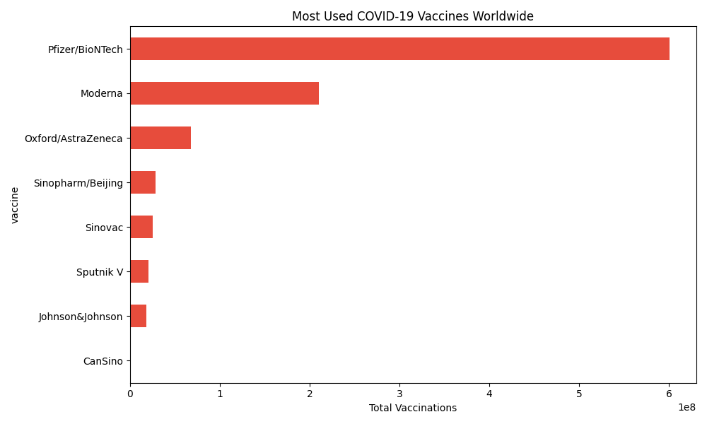
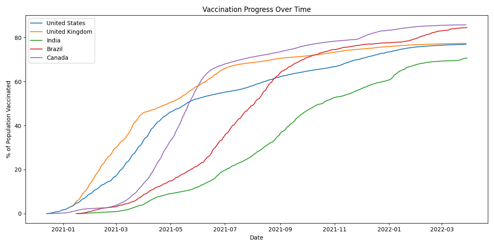

# COVID-19 Vaccination Analysis

An exploratory analysis of global COVID-19 vaccination progress using 
real-world data covering 223 countries from December 2020 to March 2022.

## Dataset
COVID-19 World Vaccination Progress from Kaggle (Our World in Data)
https://www.kaggle.com/datasets/gpreda/covid-world-vaccination-progress

Download both CSV files and place them in the same folder as analysis.py before running.

## Tools
- Python — pandas, matplotlib

## What I looked at
- Which countries vaccinated the most people in raw numbers
- Which countries vaccinated the highest percentage of their population
- Which vaccines were most widely used worldwide
- How vaccination rollout progressed over time across major countries

## Key Findings

**Raw numbers vs reality**
China and India top the raw numbers with 1.27B and 984M vaccinated respectively, 
but that's mostly because of their population size. When you look at percentage 
of population vaccinated, smaller countries like Gibraltar (124%) and UAE (99%) 
actually led the way.

**Vaccine dominance**
Pfizer/BioNTech was by far the most used vaccine with 600M doses, 
nearly 3x Moderna in second place at 210M.

**Canada's rollout**
Canada started later than the US and UK but caught up quickly and 
ended with the highest vaccination rate among the countries compared at 85%.

**Data quality**
Around 50% of the total_vaccinations column had missing values — common 
with COVID data since not every country reported daily. Worth keeping in 
mind when interpreting results.

## Charts

## Files
- `analysis.py` — full Python analysis
- Charts are generated automatically when you run the script# covid-vaccination-analysis
